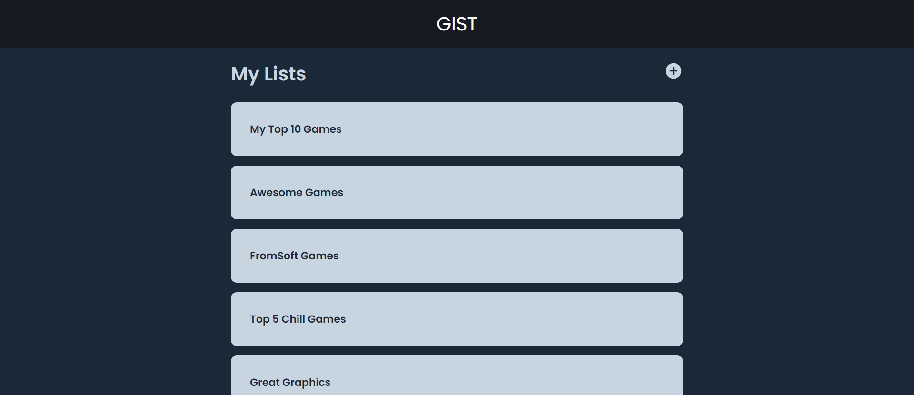
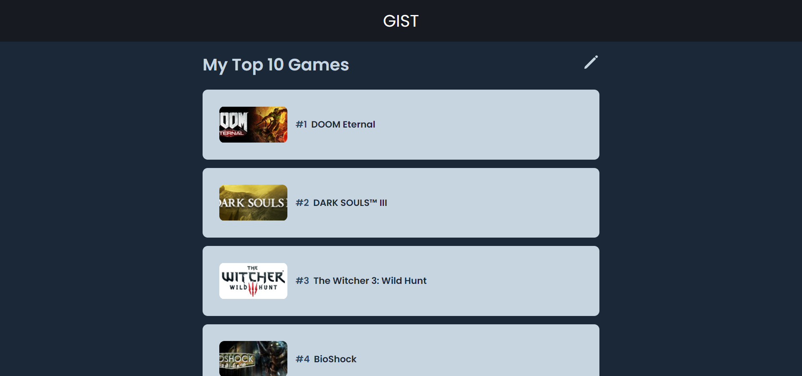
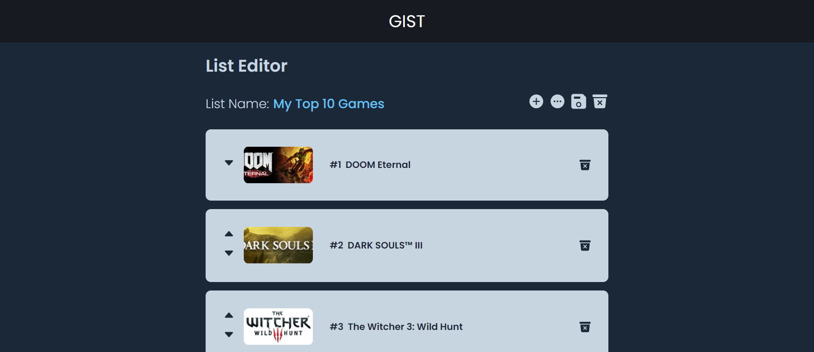
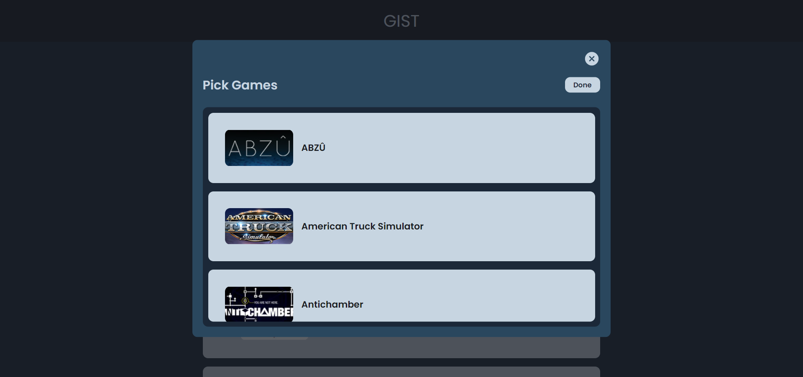

<h1 align="center">
  
</h1>

Gist is a web application that lets you create lists of the games you own on the popular gaming platform, [Steam](https://store.steampowered.com/).

## Screenshots

  

  

  

  

## Getting started

### Prerequisites

You will need a few extra things for the app to work. If you do not have any of the following dependencies installed/available, please follow the links provided and install/obtain them before proceeding with *Installation*.

- **MongoDB** - follow the installation instructions [here](https://docs.mongodb.com/manual/installation/) for your platform of choice (Community Edition will suffice). If you are using WSL2,  refer to the *Install MongoDB* section of [this article](https://docs.microsoft.com/en-us/windows/wsl/tutorials/wsl-database).
- **Steam API key** - assuming you have a Steam account, you can obtain a key [here](https://steamcommunity.com/dev/apikey).
- **Steam user ID** - the easiest way to find this out is to log in to Steam in a browser, go to your profile page (by clicking your username), and check the URL. It should look something like *https://steamcommunity.com/profiles/*****************/*, where the asterisks represent your unique ID.

### Installation
